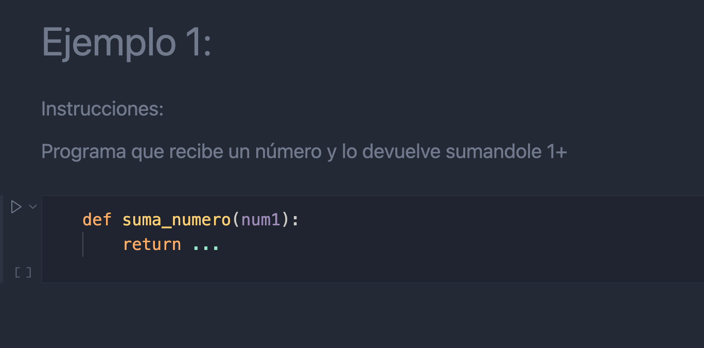
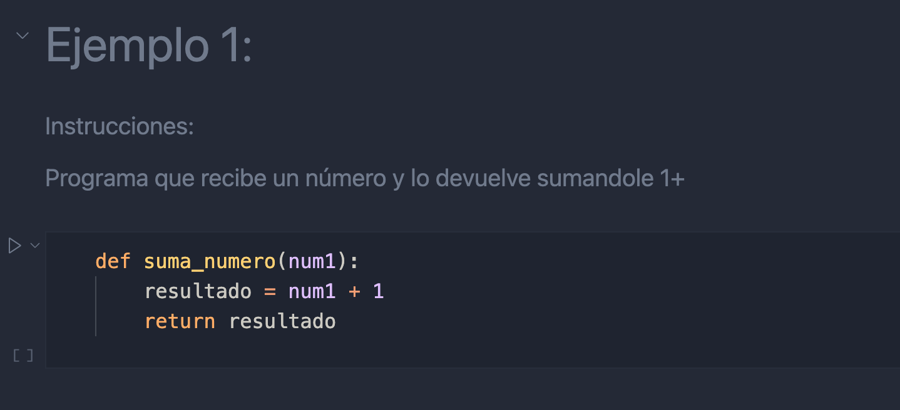
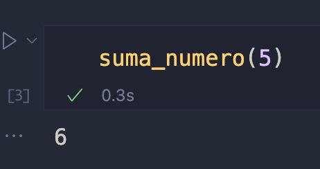
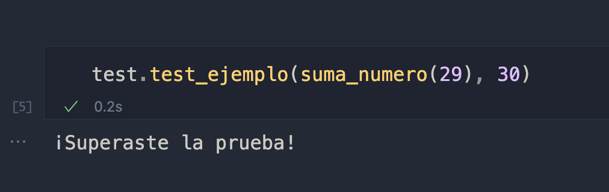

# Instrucciones de Notebook

Ya que tienes tu carpta abierta en tu editor de código, los ejercicios se encuentran en el archivo `Ejercicios.ipynb`y será el único que deberas trabajar.

Cada ejercicio vendrá con sus instrucciones. Aquí veremos un ejemplo:

Lo que debes editar es lo que esta **dentro de la función**.

El return es importante ya que es el que te ayudara a saber si tu función es correcta.

Puedes crear una celda de código para probar tu función.

Abajo de cada ejercicio, viene un código de test que pondra a prueba tu función, enviandole diferentes datos, y despues de hacer el testeo, te dira si tu función paso la prueba.

